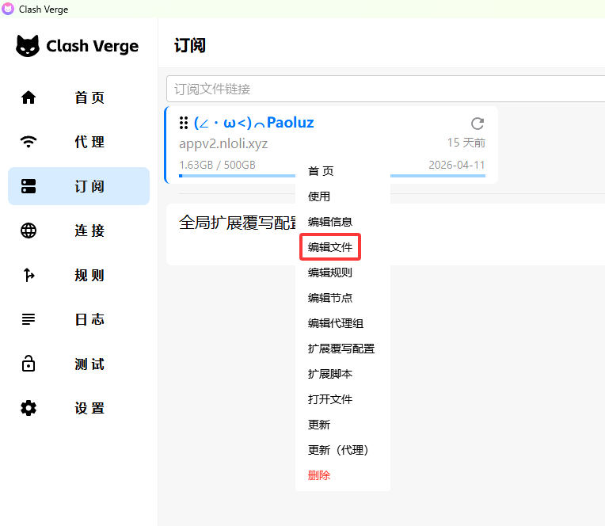

# mihomo-for-autodl

## 项目简介
本项目用于在autodl平台上快速部署mihomo作为网络代理。

## 部署流程

### 提取&修改基础配置
```bash
mv env.conf.example env.conf
```
`env.conf`中配置了代理文件的各项路径，可以不修改。

### 下载与安装mihomo
运行`source install_mihomo.sh`:
```bash
source install_mihomo.sh
```
若下载过程中出现网络问题，可以开启autodl对github的加速服务: `source etc/network_turbo`。

### 修改代理配置
进入`$CONF_DIR/config.ymal`，填入订阅信息。这里推荐直接从其它平台的代理上复制并替换全部。如:


### 修改系统配置
在`~/.bashrc`中添加以下四行:
```plaintext
export http_proxy="http://127.0.0.1:7890"
export https_proxy="http://127.0.0.1:7890"
export HTTP_PROXY="http://127.0.0.1:7890"
export HTTPS_PROXY="http://127.0.0.1:7890"
# 7890 或 你自定义的端口号
```
执行`source ~/.bashrc`使配置生效。

### 运行代理
运行`source launch_mihomo`，若出现异常，且在`$LOG_DIR`的日志文件中发现缺少文件的错误，建议开启autodl github加速服务并在 https://github.com/MetaCubeX/meta-rules-dat/releases 下载(缺什么下什么)。关闭代理后重启即可。

### 关闭代理
运行`source shutdown_mihomo.sh`。

## License
本项目遵循GPL-3.0 license。
